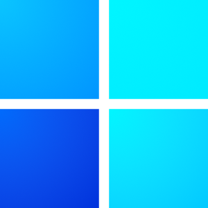
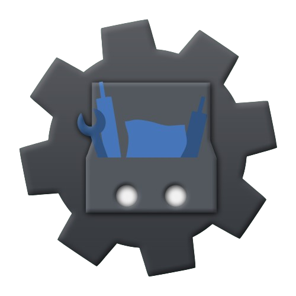
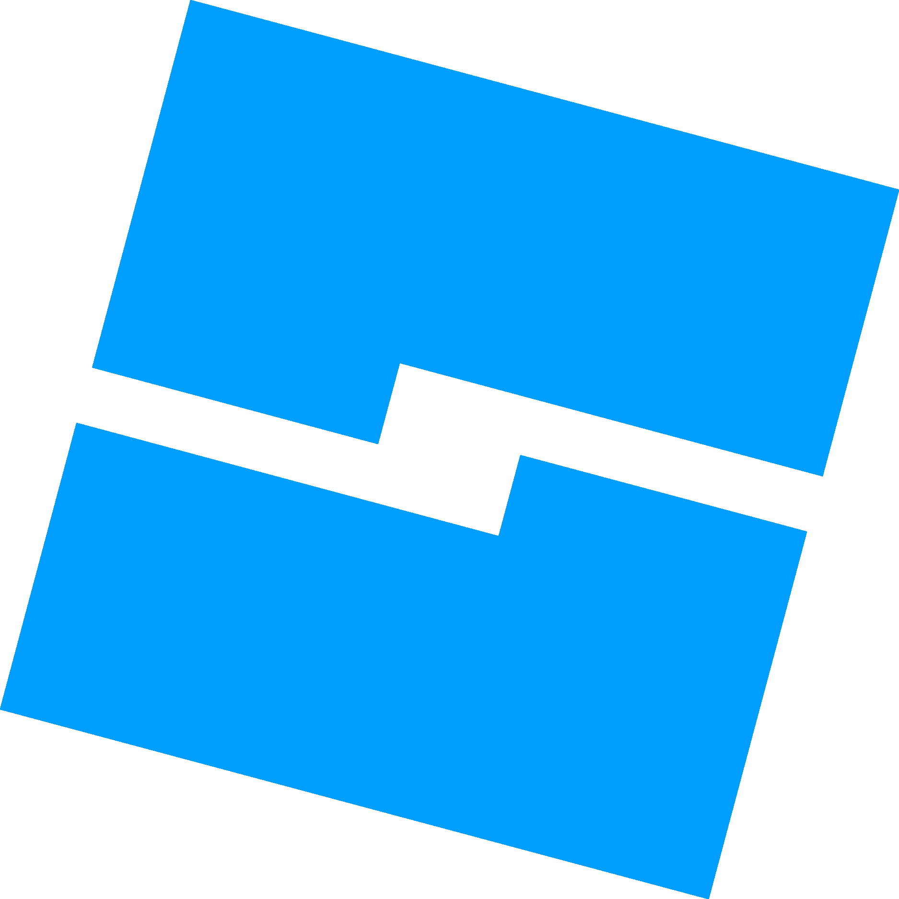

# Ma présentation
- Prénom : █████
- Nom : ███████
- âge : ██
- Adresse : ████████████████████████

****

## À propos de moi

- **Analyste confirmé** chez [Protect](https://www.protect-bot.fr/).
- **Administrateur**,**Responsable Partenariat** chez [Sky](https://skybot.fr/).
- **Co-Directeur** chez [Fenix's World](https://discord.gg/fenix).
- **Ancien Modérateur+** chez [Rinaorc](https://rinaorc.com/).

## Mes compétences

### Les outils que j'utilise

 &nbsp;

 &nbsp;

 &nbsp;

 &nbsp;

 &nbsp;

 &nbsp;

 &nbsp;

 &nbsp;

 &nbsp;

### Les librairies que j'utilise

 &nbsp;

 &nbsp;

### Les langages que j'utilise
###### Où je suis intermédiaire

 &nbsp;

###### Où je débute

 &nbsp;

 &nbsp;
 

****

 ###### Inspiration à partir du profil de [Str4ky](https://github.com/Str4ky)
